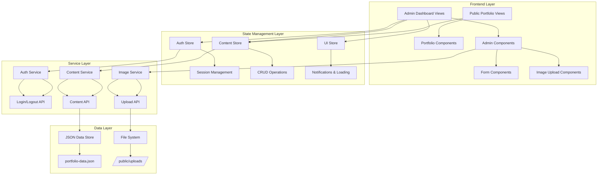
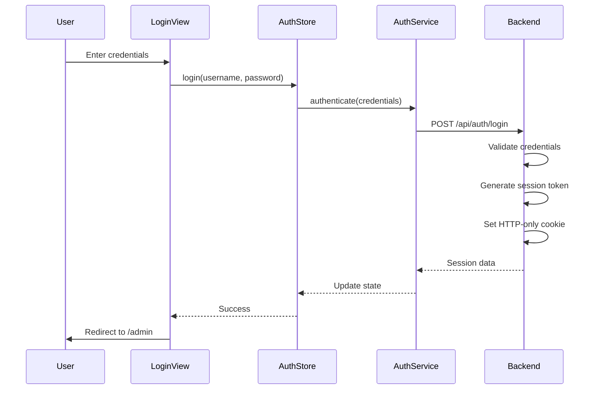
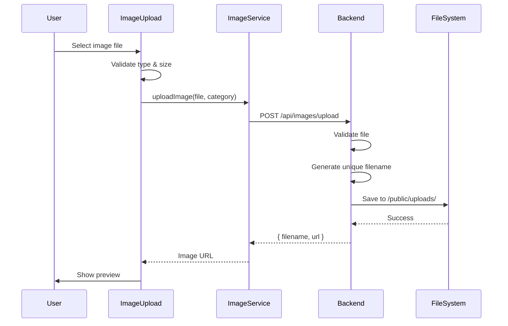

# Design Document: Admin Dashboard CRUD

## Overview

This design document specifies the technical architecture and implementation details for an Admin Dashboard with CRUD functionality for a Vue 3 portfolio application. The system enables the portfolio owner to manage all content dynamically through a secure web interface without requiring code changes.

### Design Goals

1. **Security**: Implement robust authentication and session management to protect admin access
2. **Usability**: Provide an intuitive interface for managing all portfolio content
3. **Maintainability**: Use clean separation of concerns with Pinia stores, composables, and reusable components
4. **Data Integrity**: Ensure reliable data persistence with validation and error handling
5. **Performance**: Optimize image uploads and data operations for responsive user experience

### Technology Stack

- **Frontend Framework**: Vue 3 with Composition API and TypeScript
- **State Management**: Pinia stores for authentication, content, and UI state
- **Routing**: Vue Router with navigation guards for protected routes
- **Build Tool**: Vite
- **Data Persistence**: JSON file storage with atomic write operations
- **Image Storage**: Local file system with unique filename generation
- **Authentication**: Session-based with secure HTTP-only cookies
- **Validation**: Zod for runtime type validation

## Architecture

### High-Level Architecture




### Layer Responsibilities

#### Frontend Layer
- **Public Portfolio Views**: Display portfolio content to visitors (HomeView, AboutView)
- **Admin Dashboard Views**: Protected views for content management (AdminDashboard, LoginView)
- **Portfolio Components**: Reusable components for displaying content (HeroSection, ProjectsSection, etc.)
- **Admin Components**: CRUD interface components (ContentEditor, ProjectManager, etc.)
- **Form Components**: Reusable form inputs with validation (TextInput, ImageUpload, etc.)

#### State Management Layer
- **Auth Store**: Manages authentication state, session validation, login/logout
- **Content Store**: Manages portfolio content state, CRUD operations, data synchronization
- **UI Store**: Manages UI state (loading indicators, notifications, modals)

#### Service Layer
- **Auth Service**: Handles authentication API calls and session management
- **Content Service**: Handles content CRUD API calls and data transformation
- **Image Service**: Handles image upload, validation, and storage operations

#### Data Layer
- **JSON Data Store**: Persistent storage for portfolio content in structured JSON format
- **File System**: Storage for uploaded images with unique filenames


### Routing Architecture

```typescript
// Route structure
/                          → HomeView (public)
/about                     → AboutView (public)
/admin/login               → LoginView (public)
/admin                     → AdminDashboard (protected)
/admin/hero                → HeroEditor (protected)
/admin/about               → AboutEditor (protected)
/admin/skills              → SkillsManager (protected)
/admin/projects            → ProjectsManager (protected)
/admin/experience          → ExperienceManager (protected)
/admin/contact             → ContactEditor (protected)
```

**Navigation Guards**:
- `beforeEach` guard checks authentication status for `/admin/*` routes
- Redirects unauthenticated users to `/admin/login`
- Redirects authenticated users away from `/admin/login` to `/admin`

## Components and Interfaces

### Admin Dashboard Components


#### 1. LoginView Component
**Purpose**: Authenticate admin users

**Props**: None

**State**:
- `username: string` - Input field for username
- `password: string` - Input field for password
- `error: string | null` - Error message display
- `isLoading: boolean` - Loading state during authentication

**Methods**:
- `handleLogin()` - Validates inputs and calls auth store login action
- `clearError()` - Clears error message

**Interactions**:
- Calls `authStore.login(username, password)`
- Navigates to `/admin` on success
- Displays error message on failure

#### 2. AdminDashboard Component
**Purpose**: Main admin interface with navigation to all content sections

**Props**: None

**State**:
- `currentSection: string` - Currently active section
- `hasUnsavedChanges: boolean` - Tracks unsaved changes

**Methods**:
- `navigateToSection(section: string)` - Navigate to content section
- `handleLogout()` - Logout and redirect to login
- `confirmNavigation()` - Warn user about unsaved changes

**Child Components**:
- `AdminSidebar` - Navigation menu
- `AdminHeader` - Header with user info and logout
- `<router-view>` - Dynamic content editor


#### 3. HeroEditor Component
**Purpose**: Edit Hero section content

**Props**: None

**State**:
- `heroData: HeroContent` - Local copy of hero content
- `isDirty: boolean` - Tracks if changes were made
- `validationErrors: Record<string, string>` - Field validation errors

**Methods**:
- `loadHeroData()` - Load current hero data from store
- `validateFields()` - Validate all required fields
- `handleSave()` - Save changes to store
- `handleCancel()` - Discard changes and reload
- `handleImageUpload(file: File)` - Upload new profile image

**Interactions**:
- Reads from `contentStore.hero`
- Calls `contentStore.updateHero(heroData)`
- Calls `imageService.uploadImage(file, 'hero')`

#### 4. ProjectsManager Component
**Purpose**: Manage projects with full CRUD operations

**Props**: None

**State**:
- `projects: Project[]` - List of all projects
- `editingProject: Project | null` - Currently editing project
- `isCreating: boolean` - Creating new project mode
- `validationErrors: Record<string, string>` - Validation errors

**Methods**:
- `loadProjects()` - Load all projects from store
- `createProject()` - Initialize new project creation
- `editProject(id: string)` - Load project for editing
- `saveProject(project: Project)` - Save project changes
- `deleteProject(id: string)` - Delete project with confirmation
- `handleImageUpload(file: File)` - Upload project image

**Interactions**:
- Reads from `contentStore.projects`
- Calls `contentStore.createProject(project)`
- Calls `contentStore.updateProject(id, project)`
- Calls `contentStore.deleteProject(id)`


#### 5. SkillsManager Component
**Purpose**: Manage skills with add, edit, delete, and reorder

**Props**: None

**State**:
- `skills: Skill[]` - List of all skills
- `editingSkill: Skill | null` - Currently editing skill
- `draggedSkill: Skill | null` - Skill being dragged for reordering

**Methods**:
- `loadSkills()` - Load all skills from store
- `createSkill()` - Create new skill
- `editSkill(id: string)` - Edit existing skill
- `deleteSkill(id: string)` - Delete skill
- `reorderSkills(fromIndex: number, toIndex: number)` - Reorder skills
- `handleDragStart(skill: Skill)` - Handle drag start
- `handleDrop(targetIndex: number)` - Handle drop for reordering

**Interactions**:
- Reads from `contentStore.skills`
- Calls `contentStore.createSkill(skill)`
- Calls `contentStore.updateSkill(id, skill)`
- Calls `contentStore.deleteSkill(id)`
- Calls `contentStore.reorderSkills(skills)`

#### 6. Reusable Form Components

**TextInput Component**:
- Props: `modelValue`, `label`, `placeholder`, `required`, `error`
- Emits: `update:modelValue`
- Features: Validation display, required indicator

**TextArea Component**:
- Props: `modelValue`, `label`, `placeholder`, `rows`, `required`, `error`
- Emits: `update:modelValue`
- Features: Auto-resize, character count

**ImageUpload Component**:
- Props: `currentImage`, `maxSize`, `acceptedFormats`
- Emits: `upload`, `remove`
- Features: Preview, drag-and-drop, validation, progress indicator


**ArrayInput Component**:
- Props: `modelValue: string[]`, `label`, `placeholder`, `addButtonText`
- Emits: `update:modelValue`
- Features: Add/remove items, reorder with drag-and-drop

**ConfirmDialog Component**:
- Props: `isOpen`, `title`, `message`, `confirmText`, `cancelText`
- Emits: `confirm`, `cancel`
- Features: Modal overlay, keyboard shortcuts (Enter/Escape)

**NotificationToast Component**:
- Props: `type: 'success' | 'error' | 'warning'`, `message`, `duration`
- Features: Auto-dismiss, manual close, animation

## Data Models

### Core Data Types

```typescript
// Hero Section
interface HeroContent {
  greeting: string
  name: string
  title: string
  description: string
  bio: string
  profileImage: string
  universityLink: string
}

// About Section
interface AboutContent {
  paragraphs: string[]
  skills: string[]
  aboutImage: string
}


// Skills Section
interface Skill {
  id: string
  name: string
  icon: string
  category: string
  order: number
}

// Projects Section
interface Project {
  id: string
  title: string
  category: string
  description: string
  features: string[]
  image: string
  link: string
  githubLink?: string
  featured: boolean
  order: number
}

// Experience Section
interface Experience {
  id: string
  title: string
  company: string
  duration: string
  descriptions: string[]
  order: number
}

// Contact Section
interface ContactContent {
  email: string
  subtitle: string
  socialLinks: SocialLink[]
}

interface SocialLink {
  id: string
  icon: string
  label: string
  href: string
}


// Complete Portfolio Data Structure
interface PortfolioData {
  hero: HeroContent
  about: AboutContent
  skills: Skill[]
  projects: Project[]
  experience: Experience[]
  contact: ContactContent
  metadata: {
    lastUpdated: string
    version: string
  }
}

// Authentication
interface AuthCredentials {
  username: string
  password: string
}

interface AuthSession {
  token: string
  expiresAt: number
  username: string
}

interface AuthState {
  isAuthenticated: boolean
  session: AuthSession | null
  user: { username: string } | null
}

// API Response Types
interface ApiResponse<T> {
  success: boolean
  data?: T
  error?: string
  message?: string
}

interface ImageUploadResponse {
  success: boolean
  filename: string
  url: string
  error?: string
}
```


### Validation Schemas

Using Zod for runtime validation:

```typescript
import { z } from 'zod'

// Hero validation
const heroSchema = z.object({
  greeting: z.string().min(1, 'Greeting is required'),
  name: z.string().min(1, 'Name is required'),
  title: z.string().min(1, 'Title is required'),
  description: z.string().min(1, 'Description is required'),
  bio: z.string().min(1, 'Bio is required'),
  profileImage: z.string().url('Must be a valid URL'),
  universityLink: z.string().url('Must be a valid URL')
})

// Project validation
const projectSchema = z.object({
  id: z.string(),
  title: z.string().min(1, 'Title is required'),
  category: z.string().min(1, 'Category is required'),
  description: z.string().min(10, 'Description must be at least 10 characters'),
  features: z.array(z.string()).min(1, 'At least one feature is required'),
  image: z.string().url('Must be a valid URL'),
  link: z.string().url('Must be a valid URL'),
  githubLink: z.string().url('Must be a valid URL').optional(),
  featured: z.boolean(),
  order: z.number()
})

// Email validation
const emailSchema = z.string().email('Must be a valid email address')

// URL validation
const urlSchema = z.string().url('Must be a valid URL')
```


## API Design

### Authentication API

#### POST /api/auth/login
**Purpose**: Authenticate admin user and create session

**Request**:
```typescript
{
  username: string
  password: string
}
```

**Response**:
```typescript
{
  success: boolean
  data?: {
    token: string
    expiresAt: number
    user: { username: string }
  }
  error?: string
}
```

**Implementation**:
- Validate credentials against stored hash
- Generate session token (UUID)
- Set HTTP-only cookie with token
- Store session in memory/file with expiration
- Return session data

#### POST /api/auth/logout
**Purpose**: Invalidate current session

**Request**: None (uses cookie)

**Response**:
```typescript
{
  success: boolean
  message: string
}
```

**Implementation**:
- Extract token from cookie
- Remove session from storage
- Clear cookie
- Return success


#### GET /api/auth/session
**Purpose**: Validate current session

**Request**: None (uses cookie)

**Response**:
```typescript
{
  success: boolean
  data?: {
    isAuthenticated: boolean
    user: { username: string }
    expiresAt: number
  }
}
```

**Implementation**:
- Extract token from cookie
- Validate token exists and not expired
- Return session status

### Content API

#### GET /api/content
**Purpose**: Retrieve all portfolio content

**Request**: None

**Response**:
```typescript
{
  success: boolean
  data?: PortfolioData
  error?: string
}
```

**Implementation**:
- Read portfolio-data.json
- Parse and validate JSON
- Return complete data structure


#### PUT /api/content/hero
**Purpose**: Update hero section content

**Request**:
```typescript
{
  hero: HeroContent
}
```

**Response**:
```typescript
{
  success: boolean
  data?: HeroContent
  error?: string
}
```

**Implementation**:
- Validate request body against heroSchema
- Read current portfolio-data.json
- Update hero section
- Write atomically to file
- Return updated hero data

#### POST /api/content/projects
**Purpose**: Create new project

**Request**:
```typescript
{
  project: Omit<Project, 'id' | 'order'>
}
```

**Response**:
```typescript
{
  success: boolean
  data?: Project
  error?: string
}
```

**Implementation**:
- Generate unique ID (UUID)
- Calculate order (max + 1)
- Validate against projectSchema
- Add to projects array
- Write atomically to file
- Return created project


#### PUT /api/content/projects/:id
**Purpose**: Update existing project

**Request**:
```typescript
{
  project: Project
}
```

**Response**:
```typescript
{
  success: boolean
  data?: Project
  error?: string
}
```

**Implementation**:
- Find project by ID
- Validate against projectSchema
- Update project in array
- Write atomically to file
- Return updated project

#### DELETE /api/content/projects/:id
**Purpose**: Delete project

**Request**: None (ID in URL)

**Response**:
```typescript
{
  success: boolean
  message: string
}
```

**Implementation**:
- Find project by ID
- Remove associated image if exists
- Remove from projects array
- Write atomically to file
- Return success

**Similar endpoints exist for**:
- Skills: POST/PUT/DELETE /api/content/skills
- Experience: POST/PUT/DELETE /api/content/experience
- About: PUT /api/content/about
- Contact: PUT /api/content/contact


### Image Upload API

#### POST /api/images/upload
**Purpose**: Upload image file

**Request**: FormData with file

**Response**:
```typescript
{
  success: boolean
  data?: {
    filename: string
    url: string
    size: number
  }
  error?: string
}
```

**Implementation**:
- Validate file type (jpg, png, gif, webp)
- Validate file size (max 5MB)
- Generate unique filename (timestamp + UUID + extension)
- Save to /public/uploads/
- Return file info with public URL

#### DELETE /api/images/:filename
**Purpose**: Delete uploaded image

**Request**: None (filename in URL)

**Response**:
```typescript
{
  success: boolean
  message: string
}
```

**Implementation**:
- Validate filename format
- Check file exists
- Delete file from /public/uploads/
- Return success


## Authentication and Session Management

### Authentication Flow



### Session Management

**Session Storage**:
- Sessions stored in JSON file: `data/sessions.json`
- Structure: `{ [token: string]: { username: string, expiresAt: number } }`
- Cleanup: Remove expired sessions on each validation

**Session Validation**:
- Middleware checks cookie on protected routes
- Validates token exists and not expired
- Returns 401 if invalid/expired
- Extends expiration on valid requests (sliding window)


**Security Measures**:
- Passwords hashed with bcrypt (cost factor 12)
- HTTP-only cookies prevent XSS attacks
- Secure flag in production (HTTPS only)
- SameSite=Strict prevents CSRF
- Session tokens are UUIDs (cryptographically random)
- 24-hour session expiration with sliding window
- Session regeneration after login prevents fixation

**Frontend Session Handling**:
- AuthStore checks session on app initialization
- Router navigation guard validates auth before protected routes
- Automatic logout on session expiration
- Refresh session on user activity

### Password Management

**Initial Setup**:
- Default credentials stored in environment variables
- Password hash generated on first run
- Stored in `data/admin-credentials.json`

**Password Change** (future enhancement):
- Endpoint: PUT /api/auth/password
- Requires current password verification
- Generates new hash
- Invalidates all existing sessions

## Image Upload and Storage

### Upload Flow




### Image Storage Strategy

**Directory Structure**:
```
public/
  uploads/
    hero/
      profile-{timestamp}-{uuid}.jpg
    about/
      about-{timestamp}-{uuid}.png
    projects/
      project-{timestamp}-{uuid}.jpg
    skills/
      skill-{timestamp}-{uuid}.png
```

**Filename Generation**:
- Format: `{category}-{timestamp}-{uuid}.{extension}`
- Example: `hero-1704067200000-a1b2c3d4.jpg`
- Prevents collisions and allows easy cleanup

**Image Validation**:
- Accepted formats: JPG, JPEG, PNG, GIF, WebP
- Maximum size: 5MB
- MIME type validation on backend
- File extension validation

**Image Replacement**:
1. Upload new image
2. Update content reference to new URL
3. Delete old image file
4. Atomic update ensures no broken references

**Cleanup Strategy**:
- Track image references in portfolio-data.json
- Periodic cleanup job removes orphaned images
- Manual cleanup endpoint for admin


## Data Persistence Strategy

### File-Based Storage

**Primary Data File**: `data/portfolio-data.json`

**Structure**:
```json
{
  "hero": { ... },
  "about": { ... },
  "skills": [ ... ],
  "projects": [ ... ],
  "experience": [ ... ],
  "contact": { ... },
  "metadata": {
    "lastUpdated": "2024-01-01T00:00:00.000Z",
    "version": "1.0.0"
  }
}
```

### Atomic Write Operations

**Write Strategy**:
1. Read current data from file
2. Apply modifications in memory
3. Validate complete data structure
4. Write to temporary file: `portfolio-data.json.tmp`
5. Rename temporary file to `portfolio-data.json` (atomic operation)
6. Update metadata.lastUpdated timestamp

**Benefits**:
- Prevents partial writes
- Ensures data consistency
- Recoverable from failures
- No database dependency


### Data Synchronization

**Frontend-Backend Sync**:
- Content store loads data on app initialization
- Optimistic updates: Update UI immediately, rollback on error
- Periodic refresh: Check for external changes every 5 minutes
- Version tracking: Detect conflicts using metadata.lastUpdated

**Concurrent Access Handling**:
- File locking during write operations
- Retry logic with exponential backoff
- Conflict detection: Compare timestamps before write
- User notification on conflicts

### Backup Strategy

**Automatic Backups**:
- Create backup before each write: `data/backups/portfolio-data-{timestamp}.json`
- Keep last 10 backups
- Cleanup old backups automatically

**Manual Backup/Restore**:
- Admin endpoint: GET /api/admin/backup (download current data)
- Admin endpoint: POST /api/admin/restore (upload backup file)
- Validation before restore

### Data Migration

**Version Management**:
- Track schema version in metadata.version
- Migration scripts for schema changes
- Backward compatibility for reads
- Automatic migration on first write after update


## Correctness Properties

*A property is a characteristic or behavior that should hold true across all valid executions of a system—essentially, a formal statement about what the system should do. Properties serve as the bridge between human-readable specifications and machine-verifiable correctness guarantees.*

### Property Reflection

After analyzing all acceptance criteria, I identified the following property-based tests. Several redundant properties were consolidated:

**Consolidated Properties**:
- Multiple "round-trip" properties (2.3, 3.5, 4.3, 6.4, 7.5) → Single data persistence round-trip property per content type
- Multiple validation properties (2.2, 4.2, 5.2, 6.2, 11.1) → Single required field validation property
- Multiple URL validation properties (7.6, 11.2) → Single URL validation property
- Multiple array manipulation properties (3.3, 5.4, 6.3, 7.3) → Single array manipulation property per content type
- Authentication redirect properties (1.2, 1.5, 12.2) → Single authentication redirect property

### Property 1: Authentication with Valid Credentials Creates Session

*For any* valid username and password combination, submitting credentials to the authentication system SHALL create a valid session and redirect to the admin dashboard.

**Validates: Requirements 1.2**


### Property 2: Authentication with Invalid Credentials Displays Error

*For any* invalid username or password (including empty strings, whitespace, wrong credentials), submitting to the authentication system SHALL display an error message and remain on the login page without creating a session.

**Validates: Requirements 1.3**

### Property 3: Expired or Invalid Sessions Redirect to Login

*For any* expired session or request without a valid session token, attempting to access protected admin routes SHALL redirect to the login page.

**Validates: Requirements 1.5, 1.6, 12.2**

### Property 4: Session Invalidation on Logout

*For any* valid session, when the admin user logs out, the session SHALL be immediately invalidated and subsequent requests with that session token SHALL be rejected.

**Validates: Requirements 12.5**

### Property 5: Content Data Persistence Round-Trip

*For any* valid content data (hero, about, skills, projects, experience, contact), saving the data and then retrieving it SHALL return data equivalent to what was saved.

**Validates: Requirements 2.3, 3.5, 4.3, 6.4, 7.5**


### Property 6: Required Field Validation Prevents Empty Submissions

*For any* content form with required fields, attempting to save with empty or whitespace-only values in required fields SHALL trigger validation errors and prevent submission.

**Validates: Requirements 2.2, 4.2, 5.2, 6.2, 11.1**

### Property 7: URL Format Validation

*For any* URL field (project links, GitHub links, social links, university link), providing an invalid URL format SHALL trigger a validation error, while valid URLs SHALL pass validation.

**Validates: Requirements 5.7, 7.6, 11.2**

### Property 8: Email Format Validation

*For any* email input, providing an invalid email format SHALL trigger a validation error, while valid email addresses SHALL pass validation.

**Validates: Requirements 7.2, 11.3**

### Property 9: Image File Type Validation

*For any* uploaded file, the image uploader SHALL accept files with valid image MIME types (JPG, PNG, GIF, WebP) and reject files with non-image MIME types.

**Validates: Requirements 2.4, 8.1**


### Property 10: Image Upload Generates Unique Filenames

*For any* sequence of uploaded images, each image SHALL receive a unique filename, preventing filename collisions.

**Validates: Requirements 8.3**

### Property 11: Image Replacement Removes Old File

*For any* content section with an image, when a new image is uploaded to replace the existing one, the old image file SHALL be deleted from storage.

**Validates: Requirements 8.5**

### Property 12: Array Manipulation Preserves State

*For any* array field (skills list, project features, experience descriptions, social links), adding or removing items SHALL result in the array containing exactly the expected items in the expected order.

**Validates: Requirements 3.3, 5.4, 6.3, 7.3**

### Property 13: Item Deletion Removes from Data Store

*For any* deletable item (skill, project, experience entry), when deleted, the item SHALL no longer appear in subsequent retrievals from the data store.

**Validates: Requirements 4.4, 5.6, 6.5**


### Property 14: Item Reordering Preserves Order

*For any* reorderable list (skills, experience entries), changing the order of items and saving SHALL result in the items appearing in the new order on subsequent retrievals.

**Validates: Requirements 4.5, 6.6**

### Property 15: Paragraph Formatting Preservation

*For any* biography paragraph with formatting (line breaks, spacing), saving and retrieving the paragraph SHALL preserve the original formatting.

**Validates: Requirements 3.2**

### Property 16: Independent Paragraph Editing

*For any* set of biography paragraphs, editing one paragraph SHALL not modify the content of other paragraphs.

**Validates: Requirements 3.6**

### Property 17: Featured Status Toggle Persistence

*For any* project, toggling the featured status and saving SHALL result in the new featured status being persisted and retrievable.

**Validates: Requirements 5.5**


### Property 18: Cascading Delete Removes Associated Images

*For any* project with an associated image, deleting the project SHALL remove both the project data and the associated image file from storage.

**Validates: Requirements 5.6**

### Property 19: Data Validation Prevents Invalid Persistence

*For any* invalid content data (failing schema validation), attempting to save SHALL be rejected and the data store SHALL remain unchanged.

**Validates: Requirements 9.2**

### Property 20: Concurrent Reads Return Consistent Data

*For any* concurrent read operations on the data store, all reads SHALL return the same consistent data.

**Validates: Requirements 9.4**

### Property 21: Failed Save Preserves Unsaved Changes

*For any* save operation that fails, the content manager SHALL retain the unsaved changes in the UI state and display an error message.

**Validates: Requirements 9.5**


### Property 22: Atomic Updates Prevent Partial Corruption

*For any* write operation that is interrupted or fails, the data store SHALL contain either the complete new data or the complete old data, never a partial or corrupted state.

**Validates: Requirements 9.6**

### Property 23: Navigation with Unsaved Changes Shows Warning

*For any* content editor with unsaved changes, attempting to navigate away SHALL display a warning and preserve the unsaved changes.

**Validates: Requirements 10.3**

### Property 24: Validation Errors Prevent Form Submission

*For any* form with validation errors, the save button SHALL be disabled and form submission SHALL be prevented.

**Validates: Requirements 11.5, 11.6**

### Property 25: Upload Failure Displays Error Message

*For any* image upload that fails (due to size, type, or other errors), a descriptive error message SHALL be displayed to the user.

**Validates: Requirements 8.7**


## Error Handling

### Error Categories

#### 1. Authentication Errors
- **Invalid Credentials**: Display "Invalid username or password" message
- **Session Expired**: Redirect to login with "Session expired, please log in again" message
- **Session Not Found**: Redirect to login silently
- **CSRF Token Invalid**: Display "Security validation failed, please try again" and refresh page

#### 2. Validation Errors
- **Required Field Empty**: Display "This field is required" inline
- **Invalid Email Format**: Display "Please enter a valid email address" inline
- **Invalid URL Format**: Display "Please enter a valid URL" inline
- **String Too Short/Long**: Display "Must be between X and Y characters" inline
- **Array Empty When Required**: Display "At least one item is required" inline

#### 3. File Upload Errors
- **File Too Large**: Display "File size exceeds 5MB limit" in upload component
- **Invalid File Type**: Display "Only JPG, PNG, GIF, and WebP images are allowed" in upload component
- **Upload Failed**: Display "Upload failed: [error details]" with retry option
- **Storage Full**: Display "Storage space unavailable, please contact administrator"


#### 4. Data Persistence Errors
- **File Read Error**: Display "Failed to load data, please refresh" with retry button
- **File Write Error**: Display "Failed to save changes, please try again" and retain unsaved data
- **Data Corruption Detected**: Display "Data integrity error detected" and offer to restore from backup
- **Concurrent Modification**: Display "Content was modified by another session, please refresh"

#### 5. Network Errors
- **Request Timeout**: Display "Request timed out, please try again" with retry option
- **Server Unavailable**: Display "Server is unavailable, please try again later"
- **Network Error**: Display "Network error occurred, please check your connection"

### Error Handling Strategy

#### Frontend Error Handling
```typescript
// Centralized error handler in UI store
interface ErrorHandler {
  handleError(error: Error, context: string): void
  displayNotification(type: 'error' | 'warning' | 'success', message: string): void
  clearErrors(): void
}

// Usage in components
try {
  await contentStore.saveHero(heroData)
  uiStore.displayNotification('success', 'Hero section saved successfully')
} catch (error) {
  uiStore.handleError(error, 'saving hero section')
  // Unsaved changes remain in component state
}
```


#### Backend Error Handling
```typescript
// Standardized error response format
interface ErrorResponse {
  success: false
  error: string
  code: string
  details?: Record<string, any>
}

// Error handling middleware
function errorHandler(error: Error, req: Request, res: Response) {
  if (error instanceof ValidationError) {
    return res.status(400).json({
      success: false,
      error: error.message,
      code: 'VALIDATION_ERROR',
      details: error.details
    })
  }
  
  if (error instanceof AuthenticationError) {
    return res.status(401).json({
      success: false,
      error: 'Authentication required',
      code: 'AUTH_REQUIRED'
    })
  }
  
  // Log unexpected errors
  console.error('Unexpected error:', error)
  
  return res.status(500).json({
    success: false,
    error: 'An unexpected error occurred',
    code: 'INTERNAL_ERROR'
  })
}
```


#### Retry Logic
- **Transient Errors**: Automatic retry with exponential backoff (3 attempts)
- **User-Initiated Retry**: Provide retry button for failed operations
- **Optimistic Updates**: Rollback on failure, show error, allow retry

#### Error Logging
- **Client-Side**: Log errors to console in development, send to monitoring service in production
- **Server-Side**: Log all errors with timestamp, request context, and stack trace
- **User Privacy**: Never log sensitive data (passwords, tokens) in error messages

### Graceful Degradation

- **Offline Mode**: Detect network unavailability, show offline indicator, queue changes
- **Partial Failures**: If one section fails to load, show error for that section only
- **Fallback UI**: Display cached data with "Data may be outdated" warning if fetch fails
- **Progressive Enhancement**: Core functionality works without JavaScript (login form)

## Testing Strategy

### Testing Approach

This feature requires a **dual testing approach** combining property-based testing for universal correctness properties with example-based unit tests for specific scenarios and integration tests for external interactions.


### Property-Based Testing

**Testing Library**: fast-check (JavaScript/TypeScript property-based testing library)

**Configuration**:
- Minimum 100 iterations per property test
- Each test tagged with feature name and property number
- Tag format: `Feature: admin-dashboard-crud, Property {number}: {property_text}`

**Property Test Implementation**:

```typescript
import fc from 'fast-check'
import { describe, it, expect } from 'vitest'

describe('Feature: admin-dashboard-crud', () => {
  it('Property 5: Content Data Persistence Round-Trip', () => {
    fc.assert(
      fc.property(
        fc.record({
          greeting: fc.string({ minLength: 1 }),
          name: fc.string({ minLength: 1 }),
          title: fc.string({ minLength: 1 }),
          description: fc.string({ minLength: 1 }),
          bio: fc.string({ minLength: 1 }),
          profileImage: fc.webUrl(),
          universityLink: fc.webUrl()
        }),
        async (heroData) => {
          // Save data
          await contentService.updateHero(heroData)
          
          // Retrieve data
          const retrieved = await contentService.getHero()
          
          // Assert equivalence
          expect(retrieved).toEqual(heroData)
        }
      ),
      { numRuns: 100 }
    )
  })
})
```


**Property Tests to Implement**:

1. **Authentication Properties** (Properties 1-4):
   - Generate random valid/invalid credentials
   - Test session creation, validation, expiration, invalidation
   - Verify redirect behavior

2. **Data Persistence Properties** (Property 5):
   - Generate random valid content for each section
   - Test round-trip save/retrieve for hero, about, skills, projects, experience, contact
   - Verify data equivalence

3. **Validation Properties** (Properties 6-9):
   - Generate valid/invalid inputs for required fields, URLs, emails, file types
   - Verify validation accepts valid inputs and rejects invalid inputs
   - Test boundary conditions

4. **Image Upload Properties** (Properties 10-11):
   - Generate multiple image uploads
   - Verify filename uniqueness
   - Test image replacement and cleanup

5. **Array Manipulation Properties** (Properties 12-14):
   - Generate random arrays and operations (add, remove, reorder)
   - Verify array state after operations
   - Test order preservation

6. **Data Integrity Properties** (Properties 19-22):
   - Generate invalid data and verify rejection
   - Test concurrent operations
   - Simulate failures and verify atomicity


### Unit Testing

**Testing Framework**: Vitest with Vue Test Utils

**Unit Test Focus**:
- Component rendering and UI state
- Form validation logic
- Store actions and mutations
- Service layer functions
- Utility functions

**Example Unit Tests**:

```typescript
describe('LoginView Component', () => {
  it('renders login form with username and password fields', () => {
    const wrapper = mount(LoginView)
    expect(wrapper.find('input[type="text"]').exists()).toBe(true)
    expect(wrapper.find('input[type="password"]').exists()).toBe(true)
  })
  
  it('displays error message when login fails', async () => {
    const wrapper = mount(LoginView)
    await wrapper.vm.handleLogin()
    expect(wrapper.find('.error-message').text()).toContain('Invalid')
  })
})

describe('Content Store', () => {
  it('updates hero data in state after successful save', async () => {
    const store = useContentStore()
    const heroData = { name: 'Test', title: 'Developer', ... }
    
    await store.updateHero(heroData)
    
    expect(store.hero).toEqual(heroData)
  })
})
```


### Integration Testing

**Integration Test Focus**:
- Frontend-backend API communication
- File system operations
- Image upload and storage
- Session management with cookies
- End-to-end user workflows

**Example Integration Tests**:

```typescript
describe('Hero Section Integration', () => {
  it('updates hero section and displays changes on frontend', async () => {
    // Login
    await authService.login('admin', 'password')
    
    // Update hero
    const newHero = { name: 'New Name', ... }
    await contentService.updateHero(newHero)
    
    // Reload frontend
    const displayedHero = await contentService.getHero()
    
    // Verify changes
    expect(displayedHero.name).toBe('New Name')
  })
})

describe('Image Upload Integration', () => {
  it('uploads image and makes it accessible via public URL', async () => {
    const file = new File(['image data'], 'test.jpg', { type: 'image/jpeg' })
    
    const result = await imageService.uploadImage(file, 'hero')
    
    expect(result.success).toBe(true)
    expect(result.url).toMatch(/\/uploads\/hero\//)
    
    // Verify file exists
    const response = await fetch(result.url)
    expect(response.ok).toBe(true)
  })
})
```


### End-to-End Testing

**E2E Testing Framework**: Playwright

**E2E Test Scenarios**:
1. Complete admin workflow: Login → Edit content → Save → Verify on public site
2. Image upload workflow: Upload → Preview → Save → Verify display
3. CRUD operations: Create project → Edit → Delete → Verify removal
4. Session management: Login → Idle timeout → Auto-logout → Re-login
5. Error handling: Trigger errors → Verify error messages → Retry → Success

**Example E2E Test**:

```typescript
test('admin can edit hero section and see changes on public site', async ({ page }) => {
  // Login
  await page.goto('/admin/login')
  await page.fill('input[name="username"]', 'admin')
  await page.fill('input[name="password"]', 'password')
  await page.click('button[type="submit"]')
  
  // Navigate to hero editor
  await page.click('a[href="/admin/hero"]')
  
  // Edit hero content
  await page.fill('input[name="name"]', 'Updated Name')
  await page.click('button:has-text("Save")')
  
  // Verify success message
  await expect(page.locator('.success-message')).toBeVisible()
  
  // Navigate to public site
  await page.goto('/')
  
  // Verify changes
  await expect(page.locator('.hero-content')).toContainText('Updated Name')
})
```


### Test Coverage Goals

- **Unit Tests**: 80%+ code coverage for stores, services, and utilities
- **Property Tests**: 100% coverage of all 25 correctness properties
- **Integration Tests**: All API endpoints and file operations
- **E2E Tests**: All critical user workflows

### Testing Best Practices

1. **Isolation**: Each test should be independent and not rely on other tests
2. **Cleanup**: Reset state and clean up files after each test
3. **Mocking**: Mock external dependencies (file system, network) in unit tests
4. **Real Dependencies**: Use real dependencies in integration and E2E tests
5. **Test Data**: Use factories or generators for consistent test data
6. **Assertions**: Make assertions specific and meaningful
7. **Error Cases**: Test both success and failure paths
8. **Performance**: Keep unit tests fast (<100ms), integration tests reasonable (<1s)

### Continuous Integration

- Run unit and property tests on every commit
- Run integration tests on pull requests
- Run E2E tests before deployment
- Generate coverage reports and enforce minimum thresholds
- Fail builds on test failures

